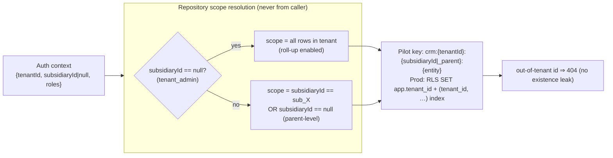

# Architecture Decision Document

_This document builds collaboratively through step-by-step discovery. Sections are appended as we work through each architectural decision together._

## Project Context Analysis

### Requirements Overview

**Functional Requirements (Epic → Feature → Story):**
7 epics, ~28 stories. Epic 0 = shared kernels (the governing contract); Epics 1–5 =
the pilot vertical slice (tenancy, leads, conversion saga + onboarding, ticketing +
timeline, dashboard/notifications); Epic 6 = server-side trust boundary (DESIGN-ONLY,
not built in the pilot). Five user journeys (UJ-1…UJ-5) and a 4-role permission matrix
drive the behavior. Architecturally the FRs reduce to one vertical thread exercised the
"right way" end-to-end — a reference implementation, not a feature demo.

**Non-Functional Requirements (NFR-1…NFR-12 — Constitution-lifted, binding):**
- NFR-1 Three-layer architecture (Product → Shared → External; deps one-way only) — the
  master constraint; enforced by an architecture-fitness test (E0-S11).
- NFR-4/NFR-5 Single `Repository<T>` seam + REST-contract parity (the localStorage adapter
  returns production HTTP shapes/codes incl. `POST /{id}/transition`, 201+Location, 204).
- NFR-6 Two-gate authZ (route + action), scope from auth context only, out-of-tenant → 404.
- NFR-7 Dual event streams (AuditEvent + DomainEvent) sharing one correlationId per mutation.
- NFR-2/3 BaseEntity standard + single status source with transition maps (422 on illegal).
- NFR-9/10 Four UI states + fixed component inventory + design tokens.
These are not aspirational quality attributes — they are contracts that bind generation
and review of every story. Epic 0 builds the kernels that make them structurally true.

**Scale & Complexity:**
- Primary domain: full-stack multi-tenant SPA (pilot frontend-only on localStorage;
  production adds a server-side trust boundary + Postgres/RLS in Epic 6).
- Complexity level: High — multi-tenancy + compensating saga + dual eventing + RBAC matrix
  + a "0-change repository swap" proof obligation.
- Estimated architectural components: ~9 shared kernels (domain/status, repository/data,
  auth/RBAC, events/audit/logging, UI inventory, flags/config, notifications, workflow/saga
  engine, test harness) + 4 product feature areas.

### Technical Constraints & Dependencies

- Fixed stack: TypeScript (strict) / React / Vite / localStorage (pilot) / Vercel (SPA).
- Adopted client baseline (ADR-006): TanStack Query v5 + React Router v7 (SPA mode) +
  React Hook Form v7 + Zod v4 + Context (Zustand only if needed); NOT Redux.
- Production targets (Epic 6, design-only here): Postgres + RLS (tenant_id leads every
  index), OIDC Auth Code + PKCE, transactional outbox + CQRS-lite read models.
- Open questions carried to architecture: F-6 (no boilerplate DB mandate — confirm),
  F-2 (tenant-grain residency — confirm with customer), F-3/OQ5 (backend placement).
- The Constitution (project-context.md) is FIXED; deviations require a decision-log entry.

### Cross-Cutting Concerns Identified

1. Tenancy & isolation — tenant_id = isolation boundary, subsidiary_id = in-tenant scoping;
   key scheme crm:{tenantId}:{subsidiaryId|_parent}:{entity}; roll-up = parent read model.
2. AuthN/Z — one AuthProvider, two-gate enforcement, 404-not-403, deny-wins.
3. Audit + events — one correlationId threaded through audit record, domain event, and logs.
4. Status state machines — single source in shared/domain/status.ts; illegal → 422.
5. Four UI states + optimistic rollback — fault-injection toggle makes rollback testable.
6. Flags/config inheritance — most-specific-wins (subsidiary > tenant > system), deny-wins.
7. The pilot→production seam asymmetry — data swap is mechanical; trust boundary is a build.

## Starter Template Evaluation

### Primary Technology Domain

**Web application — static Vite + React SPA.** Confirmed by the fixed stack
(project-context §9, ADR-006) and the existing repo scaffold (`vite.config.ts`,
`tsconfig.app.json`, `eslint.config.js`, `package-lock.json`, `index.html`, `src/`,
`public/`). The pilot is a CDN-served static SPA on Vercel with a localStorage adapter.

### Starter Options Considered

The repository is **already initialized** with the Vite React-TS toolchain, so the
relevant decision is not "which generator" but "confirm the existing scaffold is the
right base and pin the adopted libraries onto it." Options weighed:

- **Existing Vite + React + TS scaffold (SELECTED)** — already present; matches ADR-006
  exactly; Vite is the 2026 mainstream React SPA bundler with native TS + fast HMR and a
  static `dist/` output that is precisely what Vercel serves. Zero migration cost.
- **Next.js / Remix / React Router v7 *framework mode*** — REJECTED. These bias toward
  SSR/loaders/server actions. The pilot is deliberately a static SPA with a client-side
  repository; framework mode would contradict NFR-1's port discipline and the localStorage
  seam (research Topic 3 flag: use React Router v7 *library/declarative* mode only).
- **T3 / RedwoodJS / Blitz full-stack starters** — REJECTED. They impose a backend +
  ORM + tRPC/GraphQL opinion that collides with the `Repository<T>` + REST-contract seam
  (ADR-004/005) and the "trust boundary is its own epic" decision.

### Selected Starter: Existing Vite + React + TypeScript scaffold (in-repo)

**Rationale for Selection:**
The repo is already scaffolded with the exact toolchain the ADR baseline mandates; the
architecture's job is to layer the NFR-11 folder structure and the adopted libraries onto
it, not to regenerate. This keeps the pilot frontend = production frontend (NFR-4) with
only the persistence adapter swapped later. Library versions verified current as of
Jun 2026 in the technical research and re-confirmed at story time during E0 setup.

**Initialization Command (reference — scaffold already exists; this is the equivalent):**

```bash
# Base scaffold (already present in this repo):
npm create vite@latest min-crm -- --template react-ts

# Adopted libraries pinned onto it (ADR-006 / ADR-013), installed during Epic 0 setup:
npm i @tanstack/react-query react-router-dom react-hook-form zod @hookform/resolvers
npm i -D vitest @testing-library/react @testing-library/jest-dom jsdom @playwright/test
# (Zustand added only if cross-feature client state appears; OpenFeature/Unleash + OIDC are production seams)
```

**Architectural Decisions Provided by Starter:**

**Language & Runtime:** TypeScript 5.x in `strict` mode; recommend `noUncheckedIndexedAccess`
on so status enums / transition maps (`as const`) are exhaustively switched — an added
status becomes a compile error, not a runtime gap.

**Styling Solution:** Claude Design tokens only (NFR-10) — no hardcoded hex/px/font; status
colors flow exclusively from `STATUS_TONE` → tone tokens. (Token delivery mechanism — CSS
variables — is detailed in the UI kernel; no Tailwind/CSS-in-JS opinion is imposed.)

**Build Tooling:** Vite (HMR, native TS, static `dist/` for Vercel CDN); npm (lockfile present);
ESLint flat config (`eslint.config.js`) with type-aware rules added.

**Testing Framework:** Vitest (unit) + React Testing Library (component) + Playwright (E2E)
per ADR-013 / NFR-12 — wired in E0-S11 with the cross-tenant isolation E2E and the
architecture-fitness test.

**Code Organization:** NFR-11 layout — `src/app` (composition root), `src/shared/{data,domain,
auth,events,ui,config}` (+ the notifications & workflow kernels detailed later), and
`src/features/{leads,customers,tickets,dashboard}`. Detailed in the structure step.

**Development Experience:** Vite dev server + HMR; Vercel preview deploy per PR (DoD gate);
fault-injection toggle in the localStorage adapter for exercising error/rollback paths.

**Note:** Project initialization (scaffold confirm + library install + folder skeleton) is
folded into Epic 0 setup (precedes E0-S1); it is not a separate generator run.

## Core Architectural Decisions

> **Mandate for this section.** The 13 ADRs were *adopted by reference* in the PRD (§4.2)
> and brief addendum (§F). Here they are **ratified and detailed** — turned from one-line
> decisions into implementation-ready contracts. Settled decisions are **not re-opened**;
> they are made concrete. Three architecture-phase ADRs (ADR-014…016) are added to PIN the
> residuals the PRD reviews flagged. Pilot = localStorage frontend; Epic 6 production design
> is **design-only** (not built).

### Decision Priority Analysis

**Critical Decisions (block Epic 0 implementation):**
- ADR-002/003/004 — the tenant/subsidiary scoping model + the `Repository<T>` seam + the
  localStorage key scheme. Everything reads/writes through these.
- ADR-009 + **ADR-015 (NEW)** — AuthProvider/claims + the **permission-grant predicate model**
  (`own`/`restricted` defined as data) — unblocks E0-S6.
- ADR-008 — the dual-stream (audit + domain event) bus with one `correlationId` — unblocks E0-S7.

**Important Decisions (shape the architecture):**
- ADR-006/007 — client stack + optimistic-rollback + fault injection.
- ADR-011/012 — flag/config inheritance + Noop external ports.
- ADR-013 — test harness (incl. cross-tenant isolation E2E + architecture-fitness test).
- **ADR-014 (NEW)** — Notifications as a **shared-layer kernel** (Epic 0), not feature-owned.
- **ADR-016 (NEW)** — Activity-timeline vs Audit/Events-log access split (confirms DEC-4).

**Deferred Decisions (Epic 6, production — design-only here):**
- ADR-001 (Postgres + RLS Pool), ADR-005 (server-side trust boundary as a build),
  ADR-010 (residency posture). Detailed as targets; gated by Open Questions 1/2/5 (confirm
  with customer before Epic 6 kickoff).

---

### Data Architecture

#### ADR-001 — Multi-tenant isolation: Pool (shared Postgres + RLS), hybrid-to-Silo seam **[RATIFIED — production target, design-only]**
- **Decision (ratified):** production isolation is **Pool** — one shared Postgres with
  Row-Level Security — with the repository layer able to route a flagged tenant to a
  dedicated **Silo** DB later, without feature-code change.
- **Detail:** the pilot's localStorage key scheme is *already* a Pool model in miniature.
  RLS becomes the DB-level backstop **behind** the §6.3 app guards (defense-in-depth): a
  session variable (`SET app.tenant_id = …`) per request scopes every query; even a missed
  `WHERE tenant_id` cannot leak across tenants. Silo routing is a connection-resolution
  concern *inside* the repository (`resolveConnection(tenantId)`), invisible above the data layer.
- **Gate (Open Question 1):** confirm **no iSolution-boilerplate DB mandate** conflicts
  before Epic 6; if a non-Postgres mandate surfaces, RLS-as-primitive is revisited.
- **Affects:** Epic 6 (E6-S1). Pilot: nothing built; the localStorage adapter mirrors the shape.

#### ADR-002 — `tenant_id` = isolation boundary; `subsidiary_id` = in-tenant scoping dimension **[RATIFIED]**
- **Decision (ratified):** `tenant_id` is the **hard security boundary**; `subsidiary_id`
  is a **scoping/filtering dimension inside** that boundary — *not* a second isolation boundary.
- **Detail:** `subsidiaryId = null` ⇒ a **parent-level** record (tenant-wide config, shared
  `Customer` rows). Resolution rule the repository applies from auth context:
  - `tenant_admin` (token `subsidiaryId = null`) → subsidiary filter **relaxed** → sees all
    rows in the tenant (enables roll-up, UJ-5).
  - subsidiary user (token `subsidiaryId = sub_X`) → sees rows where
    `subsidiaryId = sub_X` **OR** `subsidiaryId = null` (their subsidiary + parent-level shared records).
- **This is load-bearing for the whole isolation design** and is enforced identically by the
  localStorage adapter (pilot) and RLS + query layer (production).
- **Affects:** E0-S4, E1-S1, E1-S4, E1-S5; production E6-S1.

#### ADR-003 — Mandatory RLS indexing: `tenant_id` leads every primary access index **[RATIFIED — production target]**
- **Decision (ratified):** every primary access index is a composite **`(tenant_id, …)`**.
- **Detail:** RLS without the `tenant_id`-leading composite falls back to sequential scans
  (~120 ms vs ~1.2 ms at 1M rows / 10K tenants — two orders of magnitude). **Production
  validation hook:** p95 list query **< 50 ms** at representative scale; index review is a
  **hard production gate** before load. Not relevant to the pilot (no DB) but recorded so
  E6 stories inherit it.
- **Affects:** Epic 6 (E6-S1) acceptance; data-modeling DoD for any new production index.

#### ADR-010 — Data residency: build for Posture A (region-pinned Pool); retain Silo seam for Posture B **[RATIFIED — tenant-grain, pending customer confirm]**
- **Decision (ratified, F-2 resolved):** residency enforced at **tenant grain**. Posture A
  (one region-pinned Pool Postgres) is the default; Posture B (a tenant legally requiring a
  dedicated in-country store) promotes that one tenant to a Silo DB via the ADR-001 routing seam.
- **Detail:** tenant-grain keeps the two-level Pool intact. **Subsidiary-grain residency
  would fracture the Pool** (per-subsidiary placement) and is explicitly out — flips only if
  a customer contract demands per-subsidiary placement.
- **Gate (Open Questions 2 & 5):** confirm tenant-grain **and** the off-Vercel
  region-pinnable backend cloud/region **with the customer** before Epic 6 kickoff.
- **Affects:** Epic 6 deployment topology; the Silo escape hatch in `Repository` connection resolution.

#### Data model & key scheme (NFR-2, constitution §2/§4.2) — detailed
- **`BaseEntity`** (mandatory on every persisted entity): `id` (type-prefixed UUID), `tenantId`
  (required), `subsidiaryId | null`, `createdAt/updatedAt` (ISO 8601 UTC), `createdBy/updatedBy`,
  `version` (optimistic, starts at 1), `deletedAt | null` (soft delete).
- **`WorkflowInstance`** (E0-S2, saga state) extends `BaseEntity`:
  `{ type, status, currentStep, steps[], completedSteps[], correlationId, payload }` — the
  persisted state the conversion saga (E3-S1) and onboarding workflow (E3-S2) read/resume from.
- **localStorage key scheme (pilot, fixed):** `crm:{tenantId}:{subsidiaryId|_parent}:{entity}`.
  Parent-level records key under `_parent`. The adapter **never** trusts a caller-supplied
  scope — it composes the key from `useAuth()` context only.
- **Validation:** Zod schema per entity; one schema yields the TS type *and* the runtime check;
  invalid → `422` + field-level `details` (NFR-5).

---

### Authentication & Security

#### ADR-009 — One `AuthProvider`; mock SSO → OIDC Auth Code + PKCE; fixed claims **[RATIFIED]**
- **Decision (ratified):** a single `AuthProvider` interface. Pilot = mock SSO issuing a signed
  session; production = OIDC Authorization Code + PKCE (public client, no secret, silent renew)
  behind the *same* interface, plus an **IdP→`Role` normalization layer** (the one real piece
  of work the swap adds — role claims are not standardized across Azure AD/Okta/Keycloak).
- **Claims (canonical):** `{ userId(sub), tenantId, subsidiaryId|null, roles: Role[], exp }`.
  Established once at the shell, exposed via `useAuth()`. **Tenant/subsidiary scoping everywhere
  derives from this context — never from props or client input.**
- **Header rule (NFR-5 §5.2):** client may send `X-Subsidiary-Id` to scope within its tenant;
  the server validates it belongs to the token's tenant. **Tenant id is never taken from a header.**
- **Affects:** E0-S5, E1-S4 (switcher); production E6-S4.

#### ADR-009 enforcement — two gates, deny-wins, 404-not-403 (NFR-6) — detailed
- **Gate 1 — route guard:** can this role open this screen? (declarative, per route.)
- **Gate 2 — action guard:** can this role perform *this mutation* on *this record* in *this
  tenant/subsidiary*? Evaluated against auth context + the resolved permission grant (ADR-015).
- **404-not-403:** a record outside the caller's tenant returns **`404`** (never `403`) to
  avoid leaking existence. Denied in-tenant actions emit `Auth.RoleDenied` (audited).
- **Pilot reality (the asymmetry to not gloss over):** in the pilot both gates run **client-side
  inside the adapter** — acceptable *only* because auth is mocked. Production re-implements them
  server-side (ADR-005); the client copy is demoted to a UX convenience.

#### ADR-015 (NEW) — Permission-grant predicate model: `own` and `restricted` as data **[PINNED — resolves residual #1]**
The §2.2 matrix is encoded as **data** (a `Capability × Role → Grant` table) and unit-tested
cell-by-cell (E0-S6). Each `Grant` resolves to a predicate the action guard evaluates **after**
tenant/subsidiary scoping has already filtered the candidate set. No prose, no per-screen logic.

```ts
// shared/auth/permissions.ts
type Grant = "allow" | "deny" | "view" | "own" | "restricted";
//   allow      → any in-scope record, any action of this capability
//   deny  (—)  → always false
//   view       → read actions only; ANY mutation is false
//   own        → only when isOwned(actor, resource)         [resolves the matrix "own" cells]
//   restricted → only when isOwned(actor, resource) AND action ∈ RESTRICTED_SAFE  ["restricted" cells]

const RESTRICTED_SAFE = new Set(["softDelete", "export"]); // hard-delete is NEVER in here

// "own": the actor is the responsible party on the record, or (for audit/event records) authored it.
function isOwned(actor: AuthContext, resource: OwnedResource): boolean {
  return resource.ownerId    === actor.userId   // leads/customers they own
      || resource.assigneeId === actor.userId   // tickets assigned to them
      || resource.actorId    === actor.userId;  // audit/domain records they themselves produced
}

// The single guard predicate (deny-wins is structural: default Grant is "deny"):
function can(actor: AuthContext, capability: Capability, action: Action, resource: OwnedResource): boolean {
  const grant = MATRIX[capability]?.[actor.roles[0]] ?? "deny"; // multi-role → most-permissive resolved upstream
  switch (grant) {
    case "allow":      return true;
    case "view":       return isReadAction(action);
    case "own":        return isOwned(actor, resource);
    case "restricted": return isOwned(actor, resource) && RESTRICTED_SAFE.has(action);
    default:           return false; // "deny"
  }
}
```

- **Concrete reading of the two flagged matrix cells:**
  - **"View audit/events" → `own`** (sales, support): an actor sees an audit/event record iff
    they authored it (`actorId === userId`) **or** they are the responsible party on its subject
    entity (`ownerId`/`assigneeId === userId`). `tenant_admin` = `allow`; `viewer` = `deny`.
  - **"Delete (soft)/export" → `restricted`** (sales, support): allowed **only** on records they
    own **and only** as `softDelete` or `export`. **Hard delete is never granted** by `restricted`
    — it remains `tenant_admin`-only (constitution §2). `viewer` = `deny`.
- **Multi-role resolution:** if a user carries multiple roles, the resolved grant is the
  **most-permissive** across their roles for that capability — but `deny-wins` still applies to
  the *evaluation* (default is `deny`; an explicit `deny` cell is never overridden by absence).
- **Unit-test contract (E0-S6):** the matrix table + `isOwned` + `can` are pure functions; the
  test enumerates every `(capability, role)` cell and asserts the predicate outcome against
  fixture records (owned vs not-owned, read vs mutate, soft vs hard delete).
- **Affects:** E0-S6 (encodes + tests), every guarded mutation in Epics 1–5, E4-S4 (audit-log gating).

---

### API & Communication Patterns

#### ADR-004 — Persistence behind one `Repository<T>`; localStorage/HTTP swappable at composition root **[RATIFIED]**
- **Decision (ratified):** all persistence goes through `Repository<T>` (`list/get/create/update/
  remove`); feature code **never** touches `localStorage`. `LocalStorageRepository` now,
  `HttpRepository` later, injected at the **composition root** (`src/app`). Strangler-Fig: swap
  one entity at a time or all at once via config — feature code untouched (SM-M5).
- **The 4-beat use case (NFR-4):** every mutation, inside the repository, runs
  **authorize → mutate → emit → audit** as one logical operation. No silent writes.
- **Architecture-fitness test (E0-S11):** asserts no `src/features/*` module imports
  `localStorage` or a concrete repository — the 0-change property is enforced structurally from
  day one, not just claimed at swap time.
- **Affects:** E0-S3/S4, all feature stories; production E6-S2 (the actual swap).

#### NFR-5 — REST-contract parity (the seam target) — detailed
The pilot adapter returns **production HTTP shapes and status codes** even though there is no server:
- Base `/api/v1`; plural-noun resources (`/leads`, `/customers`, `/tickets`, `/customers/{id}/tickets`).
- `GET` list → `200 Page<T>`; `GET /{id}` → `200`/`404`; `POST` → **`201 + Location`**;
  `PATCH` → `200`; `DELETE` → **`204`** (soft); **`POST /{id}/transition`** → `200` (state moves
  are operations, not field edits — keeps the transition guard authoritative).
- Errors: `400/401/403/404/409/422/429/500`. `409` on `version` mismatch; `422` on validation /
  illegal transition with field `details`. `Idempotency-Key` accepted on create.
- **Affects:** E0-S4 (adapter), every feature mutation; production E6-S2 honors the same contract.

#### ADR-005 — Server-side trust boundary is a dedicated build, not a swap **[RATIFIED — Epic 6, design-only]**
- **Decision (ratified):** scoping/validation/authorization re-implemented **server-side** with
  RLS in Epic 6; this is **net-new engineering**, not an adapter swap. Cross-tenant reads → `404`;
  the cross-tenant isolation E2E (E6-S3) is the **acceptance gate**.
- **Pilot proxy:** the E0-S11 cross-tenant E2E asserts 0 leaks against the localStorage adapter —
  **logical isolation, explicitly not a security boundary** (SM-P3). The real security gate is E6-S3.
- **Affects:** Epic 6 (E6-S1, E6-S3). The single most important caveat to not mistake for "done."

#### ADR-008 — Dual streams: in-process bus + append-only audit (pilot) → outbox + CQRS-lite (prod) **[RATIFIED]**
- **Decision (ratified):** two tenant-tagged, immutable streams — an **append-only `AuditEvent`
  log** ("who did what, when") and a **`DomainEvent` bus** ("something happened"). One mutation →
  **exactly one** of each, sharing **one `correlationId`** (NFR-7). **Not** event sourcing —
  entities are the source of truth; events are a side-effect stream.
- **Detail (pilot):** a synchronous in-process pub/sub in `shared/events`; the audit log is an
  append-only localStorage stream. `correlationId` is generated at the **start of the user action**
  and threaded through the audit record, the domain event, **and** the structured log line (NFR-8).
  Event types are `PascalCaseEntity.PastTenseAction` from the **canonical registry** — free-form
  names rejected at emit time.
- **Saga nuance (DEC-2):** the conversion saga is **multiple mutations under one shared
  `correlationId`** — each individually conformant to "one audit + one domain event," with the
  `correlationId` tying the saga together (satisfies NFR-7 per-mutation, not "two events from one mutation").
- **Detail (production target, design-only):** the **transactional outbox** — state change + event
  row in one DB txn → no lost events; a worker publishes to the broker; **at-least-once → idempotent
  consumers keyed on `eventId`**. Read models (Events Log, dashboards) are **CQRS-lite** projections.
- **Affects:** E0-S7, every mutation (UC-2), E5-S2 (read model), E5-S3 (notifications); prod E6-S4.

#### ADR-007 — Optimistic mutations + fault-injection toggle **[RATIFIED]**
- **Decision (ratified):** mutations are optimistic via TanStack Query's
  `onMutate`(cancel + snapshot + apply) / `onError`(rollback + toast) / `onSettled`(invalidate).
  Pre-increment `version` locally; a `409` in `onError` triggers rollback **and** a distinct
  "record changed, please refresh" toast (vs a generic failure). A `422` rolls back + surfaces field errors.
- **Fault-injection toggle (NFR-9):** because the localStorage adapter never fails on transport,
  a toggle forces error paths so the rollback path is **actually tested** before a backend exists.
- **Affects:** E0-S4 (toggle), E0-S9/S11 (four-state + rollback test), every mutating view.

---

### Frontend Architecture

#### ADR-006 — Client stack (NOT Redux) **[RATIFIED]**
- **Decision (ratified):** **TanStack Query v5** (server state + optimistic/rollback) ·
  **React Router v7 in library/SPA mode** (declarative; *not* framework/SSR mode) ·
  **React Hook Form v7 + Zod v4** (via `@hookform/resolvers`) · **React Context** for the few
  read-mostly global slices (auth, tenant, flags), **Zustand only if** cross-feature UI state appears.
  **No Redux.**
- **Detail:** server state and client state are separated by design — TanStack Query owns the
  async/server half; auth/tenant/flags fit Context + `useAuth()`. URL `?q=&status=&page=` filtering
  uses React Router search params (a TanStack Router swap remains a clean future option if type-safe
  search params become valuable — not a constitution conflict).
- **Affects:** all feature UIs, E0-S9 (UI kernel).

#### Four-state harness (NFR-9) — detailed
Every data-backed view handles `loading / empty / error / ready` — a DoD gate. Encode as a single
shared **`<QueryStateBoundary>`** wrapper mapping TanStack Query states:
`isPending → Skeleton` · `isError → ErrorState`(+`refetch()` retry) · `data.length === 0 → EmptyState`
(illustration + primary action) · else `ready`. The DoD check becomes "did you use the boundary?"
rather than a manual four-way audit. **Affects:** E0-S9, E0-S11, every view in Epics 1–5.

#### Fixed UI inventory & tokens (NFR-10) — ratified
Screens assemble **only** from the page templates (`ListPage`, `DetailPage`, `EntityForm`,
`Dashboard`) and the component inventory (`AppShell`, `DataTable`, `StatusPill`, `Toolbar`,
`FilterBar`, form fields, `ConfirmDialog`, `Toast`, `EmptyState`, `ErrorState`, `Skeleton`).
Claude Design **tokens only** (no hardcoded hex/px/font); status colors flow **only** from
`STATUS_TONE`. Destructive/convert actions go through `ConfirmDialog`. The saga inspector (E3-S1)
is a **`DetailPage` variant** — no new layout. **Affects:** E0-S9, all UI stories.

---

### Infrastructure & Deployment

#### Deployment topology (carried from brief §6/§8, F-3) — ratified
- **Pilot:** static Vite SPA on **Vercel** CDN; **preview deploy per PR** (DoD "preview deploy
  green" gate, wired E0-S11/E0 setup); localStorage persistence; zero backend.
- **Production (design-only):** SPA **stays on Vercel**; the **backend runs off-Vercel** on a
  region-pinnable cloud (Postgres + API + outbox worker) — Vercel offers **no BYOC**, multi-region
  is Pro/Enterprise-only, Functions default to `iad1`. The SPA calls that API cross-origin. This
  off-Vercel constraint is **load-bearing for F-2 residency** (ADR-010). **Gate:** Open Question 5
  (confirm cloud/region with customer before Epic 6).

#### ADR-011 — Flags/config: OpenFeature-shaped, most-specific-wins, deny-wins **[RATIFIED]**
- **Decision (ratified):** `useFlag(key)` / `useConfig(key)` shaped to the **OpenFeature** client
  interface; **static provider in the pilot → Unleash in production** behind the same interface.
  Evaluation context = the **auth context** (`tenantId`, `subsidiaryId`, `roles`).
- **Resolution (flag H):** **most-specific-wins `subsidiary > tenant > system`**, **deny-wins**,
  deterministic/cycle-proof. Stored as `(tenantId, subsidiaryId|null, key, value)` rows (prod) /
  a static keyed object (pilot). **Affects:** E0-S10, E1-S2 (subsidiary inherits tenant config).

#### ADR-012 — External systems + out-of-scope engines are Ports & Adapters seams only **[RATIFIED]**
- **Decision (ratified):** Odoo / Unifonic / Cloud reached **only** through port interfaces
  guarded by flags, **all OFF** in the pilot behind **Noop adapters**. Out-of-scope engines
  (billing, multi-cloud, embedded AI agent) exist as **port interfaces only** — no engine.
  **No call site references a vendor SDK directly.** **Affects:** E0-S10, NFR-1 layering.

#### ADR-013 — Testing stack: Vitest + RTL + Playwright **[RATIFIED]**
- **Decision (ratified):** **Vitest** (unit: transition maps, Zod schemas, flag-resolution chain,
  the permission matrix/`can` predicate, repository behavior) · **RTL** (component: four UI states,
  optimistic rollback via fault injection) · **Playwright** (E2E: conversion flow, ticket lifecycle,
  switcher, and the **cross-tenant isolation E2E**). Plus the **architecture-fitness test** (ADR-004).
  **Affects:** E0-S11; the DoD test-chain (TC) on every story.

---

### Architecture-phase residual ADRs (PINNED)

#### ADR-014 (NEW) — Notifications is a shared-layer kernel (Epic 0), not feature-owned **[PINNED — resolves residual #2; RECOMMENDED]**
- **Decision:** add a minimal **Notifications kernel** to the **shared layer** —
  `src/shared/notifications` (`NotificationService` + `useNotifications()`) — built in **Epic 0**,
  rather than letting **E5-S3** own notification logic.
- **Rationale (NFR-1):** the constitution lists **Notifications** among shared-platform
  capabilities (§1) and as an app-shell provider (§9). A salesperson being notified that "a lead I
  own converted" and a support agent notified that "a ticket was assigned to me" are the *same*
  capability — feature-owning it would duplicate a shared concern and violate NFR-1 ("anything
  reusable across products goes in `src/shared`"). The kernel **subscribes to the `DomainEvent`
  bus** (ADR-008) and projects in-app notifications scoped to the recipient's tenant/subsidiary
  (UC-5) — notifications are driven off domain events, **never** bespoke writes.
- **Epics impact (flag for `bmad-create-epics-and-stories`):** add a small Epic 0 story
  (e.g. **E0-S12 — Notifications kernel**: `NotificationService` subscribing to the bus, the
  notifications data shape, four-state notifications surface scaffold). **E5-S3 then *consumes*
  the kernel** (wires the bell/inbox surface + subscribes to `Ticket.Assigned`/`Lead.Converted`),
  not implements it. This keeps E5-S3's ACs intact while honoring NFR-1.

#### ADR-016 (NEW) — Activity-timeline vs Audit/Events-log access split **[PINNED — confirms DEC-4]**
Two **distinct surfaces** over the two event streams, with **different gating** — confirmed
consistent with the decision-log DEC-4 entry:

| Surface | Data source | Access gate | Who sees it |
|---|---|---|---|
| **Activity timeline** (per-record product surface, "audit-as-feature") | `DomainEvent` stream filtered by `entityType + entityId`, in scope | **Permission to view *that record*** | anyone who can view the record — **incl. `viewer`** within scope |
| **Audit/Events log** (raw compliance view) | `AuditEvent` records incl. `before/after` | **§2.2 "View audit/events" row** → `own`/`restricted` via ADR-015 | `tenant_admin` = all · `sales`/`support` = `own` · **`viewer` = none** |

- **Why this is not a matrix violation:** the timeline renders **curated `DomainEvent`s** (status
  changes, lineage, assignments) — *not* raw audit `before/after`. The matrix gates the **raw
  audit log**, which `viewer` still cannot see. The two surfaces read **different streams** with
  **different gates** by design.
- **Detail:** on a customer, the timeline **interleaves** conversion lineage (from E3-S1) with the
  ticket lifecycle (E4-S2) — one continuous story (UJ-4 climax). The audit log applies the ADR-015
  `own` predicate (`auditEvent.actorId === userId` OR responsible-party on subject entity).
- **Affects:** E2-S4 (lead timeline), E3-S3 (customer timeline), E4-S4 (both surfaces — formalizes
  the split), E0-S6 (the `own` gate for the audit log).

### Decision Impact Analysis

**Implementation sequence (Epic 0 build order, dependency-driven):**
1. **Domain/status kernel** (E0-S1) + **BaseEntity/entity types incl. `WorkflowInstance`** (E0-S2)
   — hard prerequisite for Epics 3–4 (`CUSTOMER_TRANSITIONS` was the 🔴 blocker).
2. **Repository seam** (E0-S3) + **LocalStorageRepository** (E0-S4) — needs domain types.
3. **Auth kernel** (E0-S5) + **two-gate guards encoding ADR-015 matrix** (E0-S6) — needs entities.
4. **Events/audit/logger kernel** (E0-S7/S8) — the bus the repository emits to.
5. **UI kernel + four-state harness** (E0-S9).
6. **Flags/Noop ports** (E0-S10) + **Notifications kernel (ADR-014, new E0-S12)** — subscribes to S7 bus.
7. **Test harness + fitness test + cross-tenant E2E + codified DoD** (E0-S11).

**Cross-component dependencies:**
- `correlationId` (ADR-008) is generated at the action edge and threaded by the repository
  (ADR-004) through audit + domain event + log — so ADR-004/008/NFR-8 are co-dependent.
- The action guard (ADR-009) calls `can()` (ADR-015) which reads `isOwned` against entity
  fields (`ownerId`/`assigneeId`) — so the permission model depends on the entity types (E0-S2).
- Notifications (ADR-014) depends on the event bus (ADR-008) and the scope rules (ADR-002).
- The production trust boundary (ADR-005) re-implements what the pilot adapter does client-side;
  the REST-contract parity (NFR-5) is what makes that re-implementation a contract-match, not a redesign.

## Implementation Patterns & Consistency Rules

### Pattern source of truth

**The Constitution (`project-context.md`) is the binding source for these patterns — they are
NOT re-specified here, only cited.** AI agents follow them verbatim; deviation requires a
decision-log entry:

| Pattern category | Binding source | One-line rule |
|---|---|---|
| Code/file naming | §9 | Components `PascalCase.tsx`; hooks `useThing.ts`; services `thing.service.ts`; types `thing.types.ts` |
| API naming & verbs | §5.1–§5.3 | `/api/v1`, plural nouns, `PATCH` update, `POST /{id}/transition`, `:id` style |
| Query params | §5.4 | `?q=&status=&ownerId=&page=&pageSize=&sort=`; unknown filters ignored, not errored |
| Response/error envelopes | §5.5 | `{data}` / `{data,meta}` / `{error:{code,message,details[]}}`; ISO 8601 UTC; prefixed-UUID ids |
| JSON field casing | §2/§5 | **camelCase** (TS-native; the entity types are the schema) |
| Event naming | §7.2/§7.3 | `PascalCaseEntity.PastTenseAction` from the canonical registry; free-form rejected |
| Audit/event shapes | §7.1/§7.2 | `AuditEvent` / `DomainEvent` exactly as defined; both tenant-tagged + `correlationId` |
| Status strings & tone | §3 | Only from `shared/domain/status.ts` + `STATUS_TONE`; never hardcoded |
| UI inventory & tokens | §8 | Only the fixed templates/components; Claude Design tokens; no hex/px/font |
| Folder layout | §9 / NFR-11 | `src/app`, `src/shared/{data,domain,auth,events,ui,config,notifications,workflow}`, `src/features/*` |
| Logging | §7.4 | Structured JSON `{ts,level,tenantId,subsidiaryId,actorId,msg,correlationId}`; mask PII |

The patterns below are the ones the architecture phase **adds** — the code shapes the
Constitution implies but does not write out, so every agent produces the same structure.

### Pattern 1 — The canonical 4-beat use case (every mutation, NFR-4)

Every mutating operation, **inside the repository**, follows this exact sequence as one logical
operation. This is the single most-copied shape in the codebase — agents must not invent variants.

```ts
// shared/data/LocalStorageRepository.ts (the shape; HttpRepository mirrors it server-side later)
async function mutate<T>(action: Action, fn: () => T): Promise<T> {
  const ctx = getAuthContext();                 // tenant/subsidiary/roles/userId — NEVER from caller
  const correlationId = newCorrelationId();      // 1 per user action, threaded everywhere below

  // BEAT 1 — AUTHORIZE: route guard already passed; action guard runs here.
  if (!can(ctx, capabilityFor(action), action, targetRecord)) {
    audit(ctx, `${action}.denied`, correlationId);     // Auth.RoleDenied is audited
    throw new HttpError(in_tenant ? 403 : 404);        // 404 if out-of-tenant (no existence leak)
  }
  // (validate-before-persist: Zod → 422 + field details on failure)
  const result = validateThenApply(fn);          // BEAT 2 — MUTATE (sets/bumps version, audit fields)
  bus.publish(domainEvent(result, correlationId));// BEAT 3 — EMIT one DomainEvent (canonical type)
  auditLog.append(auditEvent(result, correlationId));// BEAT 4 — AUDIT one immutable AuditEvent
  return result;                                 // same correlationId on event + audit + logs
}
```

- **Order is fixed:** authorize → mutate → emit → audit. Emit/audit happen only after a successful
  mutate; a failed authorize/validate emits **no** domain event (denials are audited only).
- **One mutation → exactly one DomainEvent + one AuditEvent + one correlationId** (UC-2/NFR-7).

### Pattern 2 — Conversion saga (DEC-2 / E3-S1) — the reference saga design

The conversion is a **persisted, resumable, compensating `WorkflowInstance`** — *not* an inline
function. It is the codebase's reference example of the Tasks/Workflow seam. It is **multiple
4-beat mutations under one shared `correlationId`** (each individually UC-2-conformant; the
correlationId ties the saga together — NOT one mutation emitting two events).

**State model (`WorkflowInstance`, E0-S2):**
```
{ id: wf_…, type: "lead_conversion", status: "running"|"completed"|"compensating"|"failed",
  currentStep: int, steps: StepName[], completedSteps: StepName[],
  correlationId, payload: { leadId, fieldMap, customerId? } } extends BaseEntity
```

**Enumerated, ordered steps — each idempotent, each with a named compensation:**

| # | Step | Forward action | Idempotency key | Compensation |
|---|---|---|---|---|
| 1 | `guard` | assert lead is `qualified` AND not already converted (`convertedToCustomerId == null`) | n/a (read-only) | none |
| 2 | `create-customer` | create `Customer` in `prospect` from the field-map | `payload.customerId` set ⇒ skip | soft-delete the customer (`Customer.Deleted`) |
| 3 | `link-lineage` | set `Customer.convertedFromLeadId` + `Lead.convertedToCustomerId` | both pointers set ⇒ skip | clear both pointers |
| 4 | `lock-lead` | transition lead `qualified → converted` (terminal/read-only) | lead already `converted` ⇒ skip | `Lead.StatusChanged` back to `qualified` |
| 5 | `emit` | the prior 4 beats already emitted `Customer.Created` + `Lead.Converted`; this step finalizes `status=completed` | already `completed` ⇒ no-op | prior steps' compensations emit the reversing **canonical** events — **no new event type invented** (NFR-7) |

**Field-map contract (explicit, reviewed-not-extended — assumption locked in PRD §12):**
`{ name, company, contactDetails(email/phone), source, ownerId, bantNote }`. Activity history is
**linked, not duplicated** (lineage pointers, not a copy).

**Resumability & idempotency:**
- An interrupted saga reloads from `WorkflowInstance.currentStep` and **continues forward**; a
  re-run of any completed step is a **no-op** (the idempotency key column above).
- **Failure path:** a mid-saga failure flips `status → compensating` and runs the compensations
  **in reverse from the failed step**, leaving **no half-made customer** and the lead back at
  `qualified`. Tested via the fault-injection toggle (ADR-007). Then `status → failed`.
- **UI-inspectable (NFR-10):** rendered on a **`DetailPage` variant** (no new layout) showing
  `steps`, `currentStep`, `completedSteps`, and outcome. `ConfirmDialog` gates the Convert action.
- **Both timelines:** a linked conversion event appears on the lead's and the customer's Activity
  timeline, sharing the saga `correlationId` (UJ-3 climax).

### Pattern 3 — Onboarding workflow (E3-S2)

The customer onboarding (`prospect → onboarding → active`) reuses the **same Tasks/Workflow seam**
(a `WorkflowInstance` of `type: "customer_onboarding"`) — proving the seam a second time. Each
accepted transition is a standard 4-beat mutation emitting `Customer.Updated` (+ `StatusChanged`
semantics). Reactivation `active ↔ inactive` and `→ churned` (terminal) obey `CUSTOMER_TRANSITIONS`.

### Pattern 4 — Status transitions (NFR-3)

State moves go through `POST /{resource}/{id}/transition` (NFR-5), **never** a `PATCH status`.
The service layer calls `canTransition(entity, from, to)` against the map in `shared/domain/status.ts`;
a move not in the map → **`422 UNPROCESSABLE`**, pill unchanged, **no** `StatusChanged` event. An
accepted move emits exactly one `<Entity>.StatusChanged` (4-beat). Customer-state gate for tickets
(`active`/`onboarding` only) is an action-guard precondition, also `422` when violated.

### Pattern 5 — Optimistic mutation + rollback (ADR-007, §4.8/§8.2)

Every mutating UI uses TanStack Query's three-callback contract — agents copy this shape:
```ts
useMutation({
  onMutate: async (vars) => { await qc.cancelQueries(key); const snap = qc.getQueryData(key);
                              qc.setQueryData(key, optimistic(snap, vars)); return { snap }; },
  onError: (err, vars, ctx) => { qc.setQueryData(key, ctx.snap);          // rollback
                                 toast(err.code === 409 ? "Record changed, please refresh"   // 409 distinct
                                                        : "Action failed"); },
  onSettled: () => qc.invalidateQueries(key),
});
```
Pre-increment `version` locally; `409` → rollback + "refresh" toast; `422` → rollback + field errors
(Zod already surfaced them client-side, so the server `422` is a backstop). The fault-injection
toggle is what makes these paths testable in the pilot.

### Pattern 6 — Four-state rendering (NFR-9)

No screen re-implements the branching: wrap data views in the shared **`<QueryStateBoundary>`**
(`isPending→Skeleton` · `isError→ErrorState`+`refetch()` · `empty→EmptyState` · else `ready`). DoD
check = "did you use the boundary?" not a manual four-way audit.

### Pattern 7 — correlationId & logging discipline (NFR-7/NFR-8)

`correlationId` is minted **at the start of the user action** (the UI mutation handler or saga
start), passed into the repository, and stamped on the `DomainEvent`, the `AuditEvent`, **and**
every structured log line for that action. Logs are JSON; emails/phones masked (`a***@x.com`);
never log tokens/passwords/PII bodies. One action is traceable end-to-end across the three streams.

### Pattern 8 — Notifications (ADR-014)

`shared/notifications` **subscribes to the DomainEvent bus** and projects in-app notifications —
never bespoke writes. A handler maps an event type → recipient (e.g. `Ticket.Assigned` →
`assigneeId`; `Lead.Converted` → lead `ownerId`), scoped to the recipient's tenant/subsidiary
(UC-5). Feature surfaces (E5-S3) consume `useNotifications()`; they don't produce notifications.

### Enforcement Guidelines

**All AI agents MUST:**
- Route every persistence call through `Repository<T>`; **never** import `localStorage` or a
  concrete repository in `src/features/*` (asserted by the E0-S11 **architecture-fitness test**).
- Use the 4-beat shape for every mutation; emit exactly one DomainEvent + one AuditEvent + one
  correlationId (asserted by a shared test helper, UC-2).
- Derive tenant/subsidiary scope from `useAuth()` context only — never from props/client input.
- Import statuses/tone from `shared/domain/status.ts` + `STATUS_TONE`; assemble UI only from the
  fixed inventory; use Claude Design tokens only.
- Reject illegal transitions with `422` via `canTransition`; gate the Convert action with `ConfirmDialog`.

**Pattern enforcement & evolution:**
- **Structural gates:** the architecture-fitness test (no feature→localStorage import), the
  one-audit+one-event test helper, transition-map unit tests, and the four-state boundary usage
  check are the automated enforcers (NFR-12). `bmad-code-review` is the human gate (DoD §10).
- **Violations** are logged in `.decision-log.md`; a pattern change is a decision-log entry +
  Constitution amendment (treated as an API change to `src/shared`).

### Pattern Examples

**Good:** `leadsRepo.transition(id, "contacted", version)` → guard passes → `version` bumps →
`Lead.StatusChanged` + audit emitted with one correlationId → pill updates optimistically.

**Anti-patterns (forbidden):** `localStorage.setItem(...)` inside a feature; `PATCH {status}` to
change state; a free-form event name like `"leadMovedToContacted"`; a status string literal
`"contacted"` in JSX instead of the enum; a bespoke `if isLoading … else if error …` ladder instead
of `<QueryStateBoundary>`; the conversion implemented as one function emitting two events.

## Project Structure & Boundaries

### Three-layer module diagram (NFR-1 — dependencies flow one direction only)

```mermaid
flowchart TD
  subgraph PRODUCT["PRODUCT LAYER — src/features/* (min-crm owns)"]
    F_LEADS["leads/"]; F_CUST["customers/"]; F_TKT["tickets/"]; F_DASH["dashboard/"]
  end
  subgraph SHARED["SHARED PLATFORM — src/shared/* (boilerplate; never imports product)"]
    S_DATA["data/ — Repository&lt;T&gt;, LocalStorageRepository"]
    S_DOMAIN["domain/ — status.ts, *.types.ts, BaseEntity, WorkflowInstance"]
    S_AUTH["auth/ — AuthProvider, useAuth, guards, permissions(ADR-015)"]
    S_EVENTS["events/ — bus, audit log, logger (correlationId)"]
    S_UI["ui/ — templates + component inventory + QueryStateBoundary"]
    S_CONFIG["config/ — useFlag/useConfig (OpenFeature-shaped)"]
    S_NOTIF["notifications/ — NotificationService (ADR-014)"]
    S_WF["workflow/ — saga engine (WorkflowInstance runner)"]
  end
  subgraph EXTERNAL["EXTERNAL SYSTEMS — ports, flags OFF (ADR-012)"]
    P_ERP["ErpSyncPort (Odoo) — Noop"]; P_MSG["MessagingPort (Unifonic) — Noop"]; P_CLOUD["CloudPort — Noop"]
  end
  APP["src/app — composition root (DI, providers, routing)"]
  APP -->|injects adapters| SHARED
  PRODUCT -->|depends on interfaces only| SHARED
  S_CONFIG -.->|flag-gated| EXTERNAL
  S_NOTIF -->|subscribes| S_EVENTS
  S_WF --> S_DATA
  S_DATA --> S_EVENTS
  S_AUTH -.->|context consumed by| S_DATA
  classDef prod fill:#e8f4ff,stroke:#2b6cb0; classDef shared fill:#eafbea,stroke:#2f855a; classDef ext fill:#fff5e6,stroke:#b7791f;
  class F_LEADS,F_CUST,F_TKT,F_DASH prod; class S_DATA,S_DOMAIN,S_AUTH,S_EVENTS,S_UI,S_CONFIG,S_NOTIF,S_WF shared; class P_ERP,P_MSG,P_CLOUD ext;
```

**Rule:** product → shared via interfaces only; shared → external via flagged ports only; **shared
NEVER imports product** (enforced by the E0-S11 architecture-fitness test). `src/app` is the only
place concrete adapters are wired (composition root).

### Data flow & 4-beat mutation diagram (one user action)

```mermaid
sequenceDiagram
  participant UI as Feature UI (TanStack Query)
  participant Repo as Repository&lt;T&gt; (adapter)
  participant Guard as can() / guards (ADR-015)
  participant Store as localStorage (pilot) / RLS DB (prod)
  participant Bus as Event bus + Audit log
  participant Notif as NotificationService
  UI->>UI: mint correlationId (action start); onMutate: snapshot + optimistic apply
  UI->>Repo: create/update/transition(id, …, version)
  Repo->>Guard: BEAT 1 authorize (auth context; out-of-tenant ⇒ 404)
  Repo->>Store: BEAT 2 mutate (validate→422; version bump→409 on mismatch)
  Repo->>Bus: BEAT 3 emit DomainEvent + BEAT 4 append AuditEvent (same correlationId)
  Bus-->>Notif: domain event fan-out (scoped to recipient)
  Repo-->>UI: REST-shaped result (200/201+Location/204)
  UI->>UI: onSettled invalidate / onError rollback + toast
```

### Isolation & tenancy diagram (ADR-002)



### Complete project directory structure

```
min-crm/
├── README.md
├── package.json                 # npm (lockfile present)
├── package-lock.json
├── vite.config.ts               # static SPA → dist/ for Vercel CDN
├── tsconfig.json / tsconfig.app.json / tsconfig.node.json   # strict, noUncheckedIndexedAccess
├── eslint.config.js             # flat config + type-aware rules
├── vercel.json                  # SPA rewrites + preview-deploy config (E0 setup)
├── playwright.config.ts         # E2E (added E0-S11)
├── vitest.config.ts             # unit/component (added E0-S11)
├── index.html
├── public/
└── src/
    ├── main.tsx                 # bootstrap
    ├── app/                     # COMPOSITION ROOT — the only place adapters are wired
    │   ├── App.tsx
    │   ├── providers.tsx        # AuthProvider, TenantProvider, FlagProvider, QueryClient, Notifications
    │   ├── router.tsx           # React Router v7 (library mode) + route guards
    │   └── composition.ts       # DI: bind Repository<T> → LocalStorageRepository (→ Http* later)
    ├── shared/                  # SHARED PLATFORM — never imports src/features/*
    │   ├── data/
    │   │   ├── Repository.ts             # interface + ListQuery + Page<T>  (E0-S3)
    │   │   ├── LocalStorageRepository.ts # 4-beat, scoping, REST shapes, fault toggle (E0-S4)
    │   │   ├── faultInjection.ts
    │   │   └── repository.test.ts
    │   ├── domain/
    │   │   ├── types.ts                  # BaseEntity, ID, WorkflowInstance      (E0-S2)
    │   │   ├── status.ts                 # enums + *_TRANSITIONS + STATUS_TONE + canTransition (E0-S1)
    │   │   ├── lead.types.ts / customer.types.ts / ticket.types.ts / tenant.types.ts
    │   │   ├── schemas.ts                # Zod schemas (one per entity)
    │   │   └── status.test.ts            # every legal + sample illegal transition (NFR-12)
    │   ├── auth/
    │   │   ├── AuthProvider.tsx          # mock SSO (→ OIDC seam, ADR-009)       (E0-S5)
    │   │   ├── useAuth.ts
    │   │   ├── permissions.ts            # MATRIX + Grant + isOwned + can()      (ADR-015, E0-S6)
    │   │   ├── guards.tsx                # RouteGuard + useActionGuard
    │   │   └── permissions.test.ts       # cell-by-cell matrix unit tests
    │   ├── events/
    │   │   ├── bus.ts                     # in-process pub/sub (→ outbox seam)   (E0-S7)
    │   │   ├── auditLog.ts                # append-only AuditEvent store
    │   │   ├── eventTypes.ts              # canonical registry (free-form rejected)
    │   │   ├── logger.ts                  # structured JSON + PII masking        (E0-S8)
    │   │   └── correlation.ts             # newCorrelationId()
    │   ├── ui/
    │   │   ├── templates/                 # ListPage, DetailPage, EntityForm, Dashboard  (E0-S9)
    │   │   ├── components/                # AppShell, DataTable, StatusPill, Toolbar, FilterBar,
    │   │   │                              #   fields, ConfirmDialog, Toast, EmptyState, ErrorState, Skeleton
    │   │   ├── QueryStateBoundary.tsx     # the four-state harness (NFR-9)
    │   │   └── tokens.css                 # Claude Design tokens (no hex/px/font elsewhere)
    │   ├── config/
    │   │   ├── FlagProvider.tsx           # OpenFeature-shaped, static → Unleash  (E0-S10)
    │   │   ├── useFlag.ts / useConfig.ts  # most-specific-wins (subsidiary>tenant>system), deny-wins
    │   │   └── ports/                     # ErpSyncPort, MessagingPort, CloudPort + NoopAdapters (ADR-012)
    │   ├── notifications/                 # ADR-014 (NEW — recommend E0-S12)
    │   │   ├── NotificationService.ts     # subscribes to event bus; maps event → recipient
    │   │   └── useNotifications.ts
    │   └── workflow/                      # saga engine (Tasks/Workflow seam)
    │       ├── WorkflowRunner.ts          # runs WorkflowInstance steps; resume/compensate
    │       └── workflowRunner.test.ts
    └── features/                          # PRODUCT LAYER — pure product code, depends on shared only
        ├── leads/        # E2-S1…S4: capture, list/filter, qualify SM, detail + timeline
        │   ├── LeadListPage.tsx / LeadDetailPage.tsx / LeadForm.tsx
        │   ├── leads.service.ts           # 4-beat use cases over Repository<Lead>
        │   ├── useLeads.ts                # TanStack Query hooks (optimistic)
        │   └── *.test.tsx
        ├── customers/    # E3-S1…S3: conversion saga, onboarding workflow, list/detail + lineage
        │   ├── conversion/                # saga definition (steps + compensations) + ConversionInspector (DetailPage variant)
        │   ├── onboarding/                # customer_onboarding workflow definition
        │   ├── CustomerListPage.tsx / CustomerDetailPage.tsx
        │   └── customers.service.ts
        ├── tickets/      # E4-S1…S4: create (customer-state gated), lifecycle, assign, timeline
        │   ├── TicketListPage.tsx / TicketDetailPage.tsx / TicketForm.tsx
        │   ├── ActivityTimeline.tsx       # DomainEvent view (record-view gated) — ADR-016
        │   ├── AuditLogPanel.tsx          # raw AuditEvent view (matrix 'own' gated) — ADR-016
        │   └── tickets.service.ts
        └── dashboard/    # E5-S1…S3: shell, one read-model widget, notifications surface
            ├── DashboardPage.tsx
            ├── widgets/ReadModelWidget.tsx # funnel OR per-subsidiary roll-up (from event log)
            └── NotificationsInbox.tsx      # consumes useNotifications() — does NOT produce
e2e/                                        # Playwright: conversion, ticket lifecycle, switcher,
    ├── cross-tenant-isolation.spec.ts      #   cross-tenant isolation (E0-S11 pilot proxy; E6-S3 prod gate)
    └── architecture-fitness.spec.ts        # asserts no features/* imports localStorage/concrete repo
```

### Architectural boundaries

- **API boundary:** `Repository<T>` is the single persistence boundary; the REST contract (NFR-5)
  is the wire shape the localStorage adapter emulates and `HttpRepository` will honor. Features
  call services; services call the repository — features never call the adapter directly.
- **Component boundaries:** features compose only `shared/ui` templates + components; cross-feature
  UI must move to `shared/ui`. Feature-to-feature communication is via the **event bus**, not direct
  imports (e.g. customers' conversion emits events tickets/dashboard observe).
- **Auth boundary:** `useAuth()` is the only source of identity/scope; guards (`RouteGuard`,
  `useActionGuard` → `can()`) are the only authorization call sites. No component reads roles ad hoc.
- **Data boundary:** scope is composed inside the repository from auth context; the localStorage key
  (`crm:{tenantId}:{subsidiaryId|_parent}:{entity}`) / RLS session var is the isolation enforcement
  point. Soft-delete (`deletedAt`) excluded from lists unless `includeDeleted=true`.
- **External boundary:** only `shared/config/ports/*` may reference an external concept, behind a
  flag, all Noop/OFF in the pilot. No vendor SDK at any call site (ADR-012).

### Requirements → structure mapping (Epic → location)

| Epic | Primary location | Key shared deps |
|---|---|---|
| **E0** Platform kernels | all of `src/shared/*` + `src/app` + `e2e/` | — (builds the kernels) |
| **E1** Tenancy & subsidiary | `app/providers.tsx` (TenantContext), `shared/ui/AppShell` (switcher), `features/dashboard` (roll-up) | data scoping (ADR-002), auth |
| **E2** Leads capture→qualify | `features/leads/*` | Repository, status SM, events, UI, timeline |
| **E3** Conversion saga & onboarding | `features/customers/conversion/*`, `features/customers/onboarding/*`, `shared/workflow/*` | WorkflowInstance, saga engine, lineage, events |
| **E4** Ticketing & timeline | `features/tickets/*` (incl. `ActivityTimeline`, `AuditLogPanel`) | customer-state gate, status SM, ADR-016 split |
| **E5** Dashboard/read-model/notifications | `features/dashboard/*`, **consumes** `shared/notifications` | event-log→read-model (CQRS-lite), Notifications kernel |
| **E6** Server trust boundary (design-only) | `src/app/composition.ts` (swap to `HttpRepository`) + new backend repo (off-Vercel) | REST contract, RLS, OIDC, outbox |

### Cross-cutting concerns → location

- **Tenancy/isolation** → `shared/data` (scope resolution) + `app/providers` (TenantContext).
- **AuthN/Z** → `shared/auth` (provider, guards, `permissions.ts`).
- **Audit+events+correlationId** → `shared/events` (bus, auditLog, logger, correlation).
- **Status machines** → `shared/domain/status.ts` (single source).
- **Flags/config + ports** → `shared/config`.
- **Notifications** → `shared/notifications` (ADR-014).
- **Saga/workflow** → `shared/workflow` (engine) + per-feature saga *definitions*.

### Integration points & data flow

- **Internal:** UI → service (4-beat) → `Repository<T>` → store; repository → event bus + audit log
  (one correlationId); bus → subscribers (NotificationService, dashboard read-models, Events Log).
- **External (pilot):** all ports Noop/OFF — flipping a flag does nothing until an adapter exists
  (intended seam behavior).
- **Data flow (production target, design-only):** API edge mints/forwards correlationId → server
  re-runs 4-beat with RLS → state + event row in one txn (outbox) → worker → broker → read-model
  projections → SPA reads via `HttpRepository`. SPA stays on Vercel; backend off-Vercel.

## Architecture Validation Results

### Coherence Validation ✅

**Decision Compatibility:** No contradictions. The stack is internally consistent — TanStack Query
v5 (server state + optimistic/rollback) + React Router v7 (SPA mode) + RHF v7 + Zod v4 + Context,
all current Jun-2026 mainstream and co-compatible. The pilot/production split is clean: every
cross-layer boundary (Repository, AuthProvider, event bus, flags, ports) is an interface with a
pilot adapter and a named production target. The one deliberate asymmetry — trust boundary is a
*build*, not a swap (ADR-005) — is explicitly walled into Epic 6 and called out repeatedly.

**Pattern Consistency:** The Constitution is the single binding source for naming/API/event/UI
patterns; the architecture adds only the shapes it leaves implicit (4-beat, saga, optimistic,
four-state, correlationId, notifications). No naming or format pattern conflicts the Constitution.
Status strings, tones, and transitions resolve to one source (`shared/domain/status.ts`).

**Structure Alignment:** The `src/` tree realizes NFR-1/NFR-11 exactly — `app` (composition root),
`shared/{data,domain,auth,events,ui,config,notifications,workflow}`, `features/*`. The dependency
direction is enforced structurally (architecture-fitness test). Every kernel maps to an Epic 0
story; every feature folder maps to an Epic 1–5 story.

### Requirements Coverage Validation ✅

**Epic/Feature coverage (all mapped to architecture):**

| Epic | Architecturally supported by | Status |
|---|---|---|
| E0 kernels | `src/shared/*` + `src/app` + `e2e/` (every story → a file/kernel) | ✅ |
| E1 tenancy | ADR-002 scope resolution, TenantContext, switcher, roll-up read model | ✅ |
| E2 leads | leads feature + status SM + 4-beat + timeline (ADR-016) | ✅ |
| E3 conversion/onboarding | saga engine (`shared/workflow`) + step/compensation table + WorkflowInstance | ✅ |
| E4 ticketing/timeline | customer-state gate + status SM + ADR-016 dual surfaces | ✅ |
| E5 dashboard/notifications | event-log→read-model (CQRS-lite) + Notifications kernel (ADR-014) | ✅ |
| E6 server trust boundary | ADR-001/003/005/010 detailed as design-only targets + composition-root swap | ✅ (design-only) |

**NFR coverage:**

| NFR | Addressed by | NFR | Addressed by |
|---|---|---|---|
| NFR-1 three-layer | module diagram + fitness test | NFR-7 dual streams | ADR-008 + 4-beat |
| NFR-2 BaseEntity | domain types + WorkflowInstance | NFR-8 logging/PII | logger pattern (P7) |
| NFR-3 status source | status.ts + canTransition (P4) | NFR-9 four states + rollback | QueryStateBoundary + fault toggle |
| NFR-4 repo seam/4-beat | ADR-004 + Pattern 1 | NFR-10 UI inventory/tokens | ADR-006 + ui kernel |
| NFR-5 REST parity | NFR-5 detail block | NFR-11 folders/naming | structure tree |
| NFR-6 two-gate/404 | ADR-009 + ADR-015 | NFR-12 testing | ADR-013 + e2e/ |

**ADR coverage:** ADR-001…013 all ratified+detailed; ADR-014 (Notifications kernel), ADR-015
(`own`/`restricted` predicates), ADR-016 (timeline/audit split) added to pin the residuals.

### Implementation Readiness Validation ✅

- **Decision completeness:** all critical decisions documented; client versions pinned by
  reference (re-confirmed at E0 `npm i`); production targets gated by Open Questions 1/2/5.
- **Structure completeness:** complete tree with story-level file mapping; boundaries explicit.
- **Pattern completeness:** the 8 added patterns cover every identified AI-agent conflict point
  (persistence access, mutation shape, event naming, status moves, error/rollback, four states,
  correlationId, notifications) with good/anti-pattern examples and structural enforcers.

### Gap Analysis Results

**Critical gaps:** none — no blocker to Epic 0 implementation.

**Important (carry to downstream phases — not architecture blockers):**
1. **Epics-phase action (ADR-014):** add **E0-S12 (Notifications kernel)** and re-scope **E5-S3**
   to *consume* it. Recorded for `bmad-create-epics-and-stories`.
2. **Open Questions 1/2/5** (boilerplate DB mandate, tenant-grain residency, backend cloud/region)
   — owned by architecture+customer, **revisit-before-Epic-6-kickoff**; do not block the pilot.
3. **Read-model widget choice (OQ3)** — funnel vs roll-up — deferred to sprint planning (E5-S2).

**Nice-to-have:** TanStack Router swap option for type-safe URL filters (clean future swap, not now);
`WorkflowRunner` could later generalize beyond conversion/onboarding if more sagas appear.

### Validation Issues Addressed

The three PRD-review residuals are all resolved in-document: `own`/`restricted` are now testable
data predicates (ADR-015); Notifications placement is decided (shared kernel, ADR-014); the
timeline/audit-log split is confirmed consistent with DEC-4 (ADR-016). No open contradictions remain.

### Architecture Completeness Checklist

**Requirements Analysis**
- [x] Project context thoroughly analyzed
- [x] Scale and complexity assessed
- [x] Technical constraints identified
- [x] Cross-cutting concerns mapped

**Architectural Decisions**
- [x] Critical decisions documented with versions
- [x] Technology stack fully specified
- [x] Integration patterns defined
- [x] Performance considerations addressed (ADR-003 p95<50ms prod gate; Page<T> payload bounds)

**Implementation Patterns**
- [x] Naming conventions established (Constitution §9, cited)
- [x] Structure patterns defined
- [x] Communication patterns specified (event bus, canonical event registry, correlationId)
- [x] Process patterns documented (4-beat, optimistic/rollback, four-state, saga)

**Project Structure**
- [x] Complete directory structure defined
- [x] Component boundaries established
- [x] Integration points mapped
- [x] Requirements to structure mapping complete

### Architecture Readiness Assessment

**Overall Status:** READY FOR IMPLEMENTATION (all 16 checklist items `[x]`; no Critical Gaps open;
Important items are downstream actions, not architecture blockers).

**Confidence Level:** High — the architecture is a *detailing* of an already-settled, reviewed
baseline (PRD final, rubric strong, 0 critical/0 high), not a fresh derivation.

**Key Strengths:**
- The pilot frontend IS the production frontend; only adapters swap (data) — the trust boundary is
  honestly isolated as a build (the project's biggest risk, explicitly fenced).
- Every NFR has a structural enforcer (fitness test, one-event test helper, transition tests,
  four-state boundary), so conformance is mechanical, not aspirational (SM-M2/M3).
- The three flagged residuals are pinned as testable contracts, ready for E0-S6 / E0-S12 / E4-S4.

**Areas for Future Enhancement:**
- Resolve Open Questions 1/2/5 with the customer before Epic 6.
- Generalize the workflow runner if additional sagas emerge; consider TanStack Router for typed URL filters.

### Implementation Handoff

**AI Agent Guidelines:**
- Follow the ADRs and the 8 implementation patterns exactly; the Constitution is the binding source
  for naming/API/event/UI — deviation requires a `.decision-log.md` entry.
- Route all persistence through `Repository<T>`; never import `localStorage` in `src/features/*`.
- Every mutation = one 4-beat use case = one DomainEvent + one AuditEvent + one correlationId.
- Derive tenant/subsidiary scope from `useAuth()` only; out-of-tenant → 404.

**First Implementation Priority:** Epic 0 setup — confirm the Vite scaffold, install the ADR-006/013
libraries, lay down the NFR-11 folder skeleton, then **E0-S1 (status kernel) → E0-S2 (entities +
WorkflowInstance)** as the hard prerequisites for everything downstream.

## Handoff to bmad-create-epics-and-stories

This architecture is ready to be expanded into implementation-ready stories. Carry these forward:

**New stories / re-scopes to apply (architecture-phase decisions):**
- **ADD E0-S12 — Notifications kernel** (`shared/notifications`): `NotificationService` subscribing
  to the DomainEvent bus, the notification data shape, recipient mapping, and a four-state surface
  scaffold (ADR-014). *Inherits: UC-1, UC-5, TC.*
- **RE-SCOPE E5-S3** — it now **consumes** `useNotifications()` (wires the inbox/bell + subscribes
  to `Ticket.Assigned`/`Lead.Converted`); it no longer implements notification logic (ADR-014).
- **E0-S6** encodes the **ADR-015** permission model: the `Capability × Role → Grant` table,
  `isOwned`, and `can()`, with cell-by-cell unit tests (`own`/`restricted` now concrete predicates).
- **E4-S4 / E2-S4 / E3-S3** implement the **ADR-016** split: `ActivityTimeline` (DomainEvent,
  record-view gated) vs `AuditLogPanel` (raw AuditEvent, matrix-`own` gated).

**Binding contracts every story spec must reference:**
- The 8 implementation patterns (esp. the 4-beat use case and the conversion saga step table).
- The NFR↔ADR coverage matrices and the Epic→location map for placing code in the NFR-11 tree.
- The Universal Conformance ACs (UC-1…UC-5) + TC already defined in PRD Epic 0.

**Carry-forward open items (owners + revisit conditions):**
- OQ1 boilerplate DB mandate, OQ2 tenant-grain residency, OQ5 backend cloud/region —
  **architecture + customer**, revisit **before Epic 6 kickoff** (do not block the pilot).
- OQ3 read-model widget (funnel vs roll-up) — **sprint planning** (E5-S2).

**Epic 6 remains DESIGN-ONLY** — detailed here as production targets (RLS, server trust boundary,
OIDC, outbox); not built in the 2-week pilot cut.

### Build / dev / deploy

- **Dev:** Vite dev server + HMR; `localStorage` persistence; fault-injection toggle for error paths.
- **Build:** `vite build` → static `dist/`; `tsc` strict typecheck + ESLint as CI gates.
- **Deploy (pilot):** Vercel static SPA + **preview deploy per PR** (DoD gate). Production backend
  is off-Vercel (Epic 6, design-only); the SPA build is unchanged across the swap.
